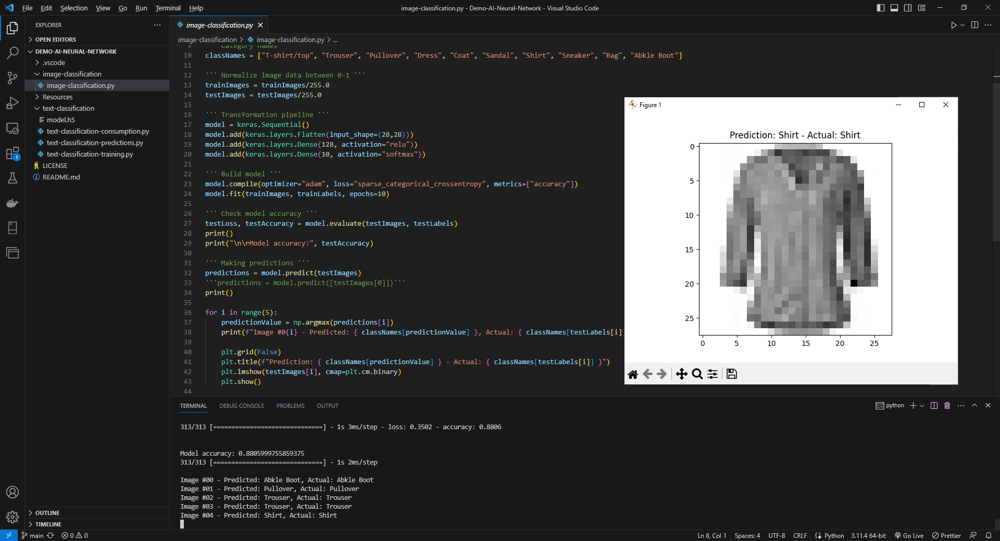
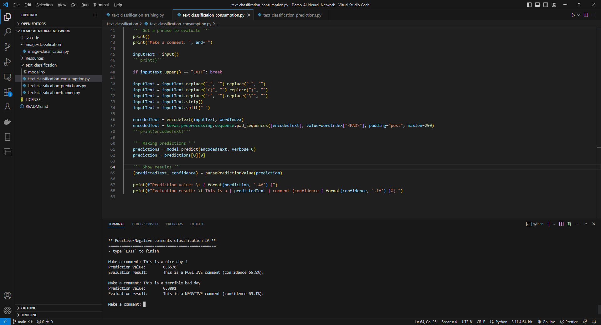

# Demo AI Neural Network

A demo proyect using Python 3 and Keras+Tensorflow 2.12 for images recognition, comments clasification (positive/negative), and so on.

&nbsp;

### Proyects

| Name                   | Description                                                                      |
|------------------------|----------------------------------------------------------------------------------|
| `image-classification` | Image recognition model, based on FASHION_MNIST dataset.                         |
| `text-classification`  | Text classification (positive/negative) model, based on IMDB sentiment dataset.  |
|                        | A chatbot app for this model is also provided: 'text-classification-chatbot.py'. |

&nbsp;

### Screenshots

| Image classification                                | Text classification chatbot                         |
|-----------------------------------------------------|-----------------------------------------------------|
|           |            |

See 'Rescources' sub-folder for more pictures & videos of the project.

&nbsp;

### Version History

v1.0 (2023.07.05) - Initial release.  

&nbsp;

This source code is licensed under MIT licence.  
Please send me your feedback about this project: andres.garcia.alves@gmail.com
